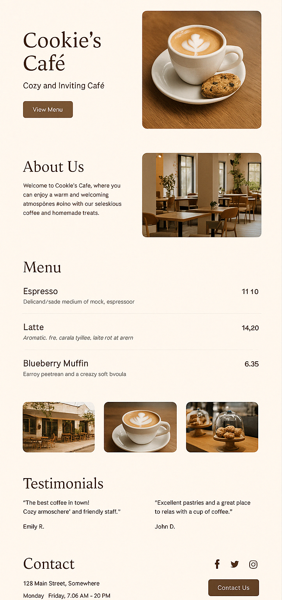

# Cookie's Café Website 🍪☕  
A cozy and inviting café website created by converting a given design into a fully functional and responsive webpage using HTML and CSS.

## 📸 Project Preview
  
*Note: The original design was provided as a static image.*

## ✨ Project Overview
This is a frontend-only project where the goal was to convert a design mockup into a responsive and visually appealing website. It includes sections such as:
- Hero Section (with café name, tagline, and button)
- About Us
- Menu
- Testimonials
- Contact Info
- Social Media Links

## 🛠️ Technologies Used
- HTML5
- CSS3 (Flexbox + Media Queries for responsiveness)
- Google Fonts 
- Font Awesome 

## 📱 Responsive Design
The website layout is fully responsive and adjusts smoothly across various screen sizes including desktops, tablets, and mobile devices.

## 🧠 What I Learned
- Converting a static design to code
- Building responsive layouts
- Managing visual hierarchy and typography
- Structuring clean, semantic HTML

## 🚀 How to Run the Project
1. Clone the repository  
   ```bash
   git clone https://github.com/khushi1k801/Cookies-Cafe--Web.git